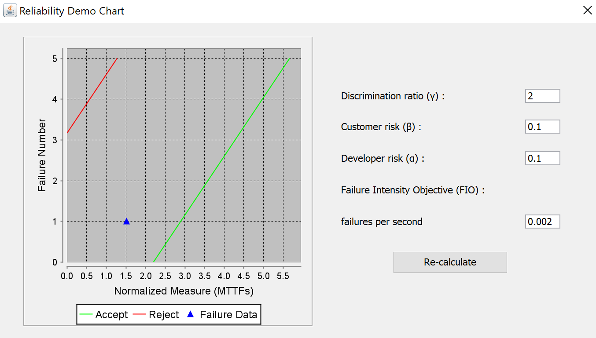
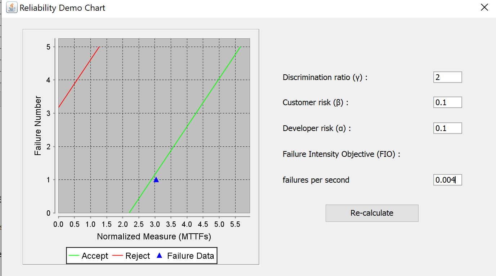
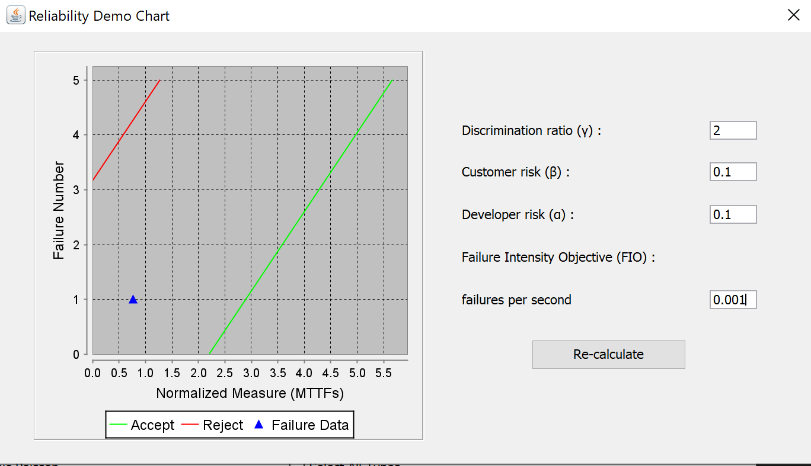
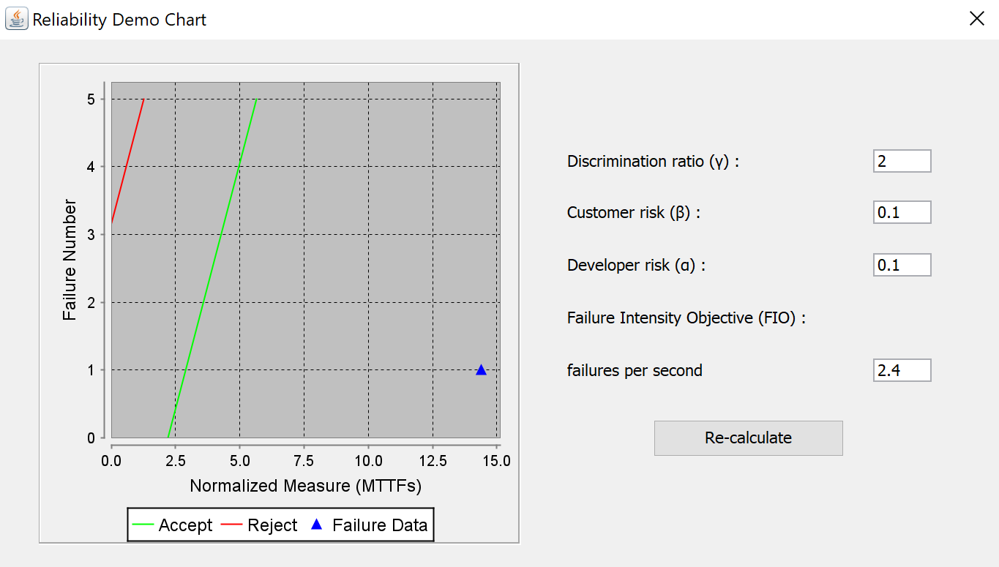
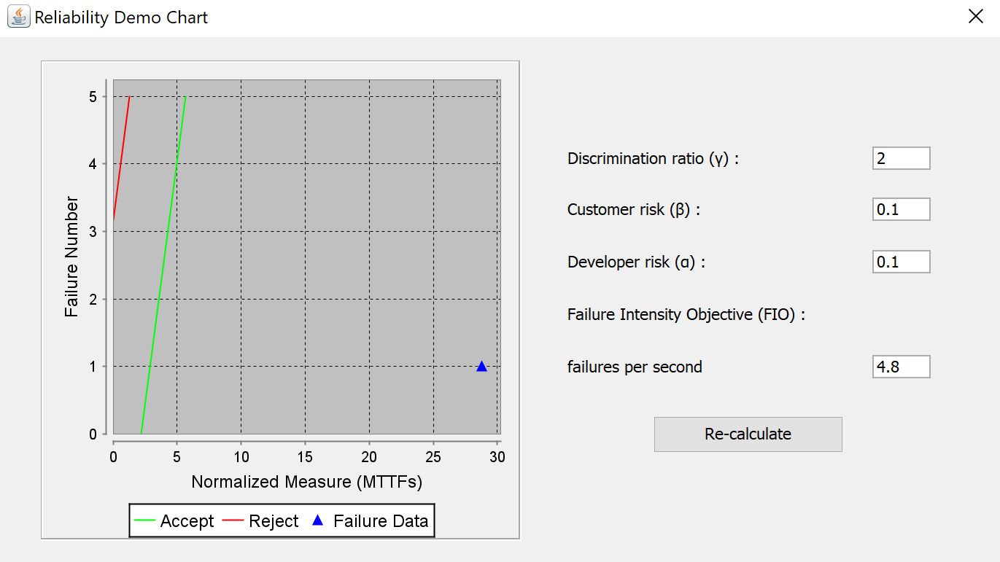
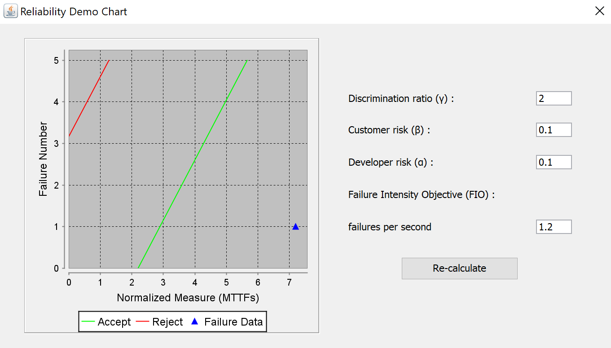

**SENG 438- Software Testing, Reliability, and Quality**

**Lab. Report \#5 – Software Reliability Assessment**

| Group 23:       |   |
|-----------------|---|
| Jennifer Jay    |   |
| Nicole Heather  |   |
| Nora Melik      |   |
| Creek Thompson  |   |

# Introduction

Software reliability and quality are the parts of the final steps of testing for an application. As a result, we are now shitfting away from unit testing with source code to focusing on the deployment and integration of program. Through the use of these reliability testing tools we can experiment with different models and metrics in order to properly determine if our SUT meets our desired requirements. This kind of testing however is not just for the developers themsevles, but also allows stakeholders and purchasers to undertsand and have input on the kind of thresholds in place for the program. As a result reliability and quiality testing are major parts of testing within software, and provide insights into the determination and risk assesment of deploying a product.

# Assessment Using Reliability Growth Testing 

Result of model comparison (selecting top two models):

Result of range analysis (an explanation of which part of data is good for proceeding with the analysis):

Plots for failure rate and reliability of the SUT for the test data provided:

A discussion on decision making given a target failure rate:

A discussion on the advantages and disadvantages of reliability growth analysis:

# Assessment Using Reliability Demonstration Chart 

3 plots for MTTFmin, twice and half of it for your test data:

For Dataset CSR2.DAT:

- Standard MTTFmin:

- Double MTTFmin:

- Half MTTFmin:

For Dataset J1.DAT:

- Standard MTTFmin:

- Double MTTFmin:

- Half MTTFmin:

Explain your evaluation and justification of how you decide the MTTFmin:

CSR2.DAT:
- Evaluation of Result:
 - MTTFmin Justification: 
    The original dataset lacks a specific time unit for its time-between values, however this is ignorable since they are normalized when plotted into the RDC. First we start with a reasonable assumption on the usage and up-time for MTTF, that way we can cover for a standard, very high and very low MTTFmin when re-calculating and re-making the graph. We must also take into account the tool used and readability when evaluating the output, a value that is too high or too low makes the result difficult to undertsand. For this failure dataset we can assume that each time unit can be equated to a second (for the sake of using SRTAT) and that we have system that functions reasonably. 
    
    From looking at our provided data, our system ran for a total of 61,316 time units, with a total of 129 failures. So lets say that our starting FIO is 129 / 61,316 = 0.002 failures / second. Taking into account the data from our report helps keep the persepective of how the system actually functioned, instead of needing to assume off of no knowledge. This means our MTTFmin is 1.5, doubling it gives; MTTFmin * 2 = 3 and dividing it gives; MTTFmin / 2 = 0.75.

J1.DAT:
- Evaluation of Result:
- MTTFmin Justicfication:
    Very similarly to the previous dataset, we lack any specific time units to use as a benchmark. So we will be approaching this data set in the same way. This includes taking into account the data that we already have, and ensuring that we still make reasonable assumptions so that evaluating the resulting charts are made clear. For the sake of consistancy, we are not changing any risk values or discrimination factors. 

    The failure count data gives us a slighly different view into the functioning of this system. The time intervals are always set in singles slices, whereas the counting of failures resets each time. After running for a total of 62 time units, we have a total of 150 failures. This leaves us with a failure rate of 150 / 62 = 2.4 failures per time unit. Setting this as our FIO, we have a MTTFmin value of around 14. Now much like before we can both double (MTTFmin * 2 = 28), and half this (MTTFmin / 2 = 7). 

A discussion on the advantages and disadvantages of RDC:

RDC is general is easily undertsood in both the developer and the consumer eye, this makes it cost effective and time efficient when in practice.

# Comparison of Results

# Discussion on Similarity and Differences of the Two Techniques

# How the team work/effort was divided and managed

The planning of the stages where all done together, individually each member had some times to familiarize themsevles with the specific tools being used. Then all member met together to follow though on the execution and analysis of the ouput of our reliablility testing tools. This was done all together unlike the previous labs because of the lack of coding required, as well as wanting the analysis and comparison to be freely disscused and argued among everyone.

As for the lab report itself, all members contirbuted to each section in some way. This includes writing, editing and quality assurance. This way we could have a consistant report while still distributing work around evenly between each member. 

# Difficulties encountered, challenges overcome, and lessons learned

Originally, there where some issues in regards to the functioning of the tools used. This resulted in more time needing to be taken to get used to our tools as well a figure out how to approach the analysis and comparison of our results.

However this lab was an insightful look into the uses and procedure of both reliability growth testing and the demonstration chart. Being able to look at the many different uses and models used for the visualization of reliability and quality was benificial in our understanding of software testing.

# Comments/feedback on the lab itself

This lab had some issues with the instructions and tools given. Although followable, the instructions in the lab document lacked any details. It is difficult, especially for a subjective task, to ensure that the process of choosing models, interpreting graphs and setting new values are all done somwhat correctly. It would help to have a more concrete explanation within the lab itself than have to read over the large amount of documentation given for each tool we might use, as it is hard to discern what information is relevant.\

There is also some issues with the tool provided themselves. These tools look very different than what was provided in the document, and the data that was given in order to complete the section for part 1 was unusable. We where able to test and learn how to use these tool using the sample data provided, but that data was not the target for this lab. There is also an issue with the computing time and errors with SRTAT specifically, where some models and formulas gave unuexplanable errors, or would execute seemingly forever and needed to be shut down through the task manager.
